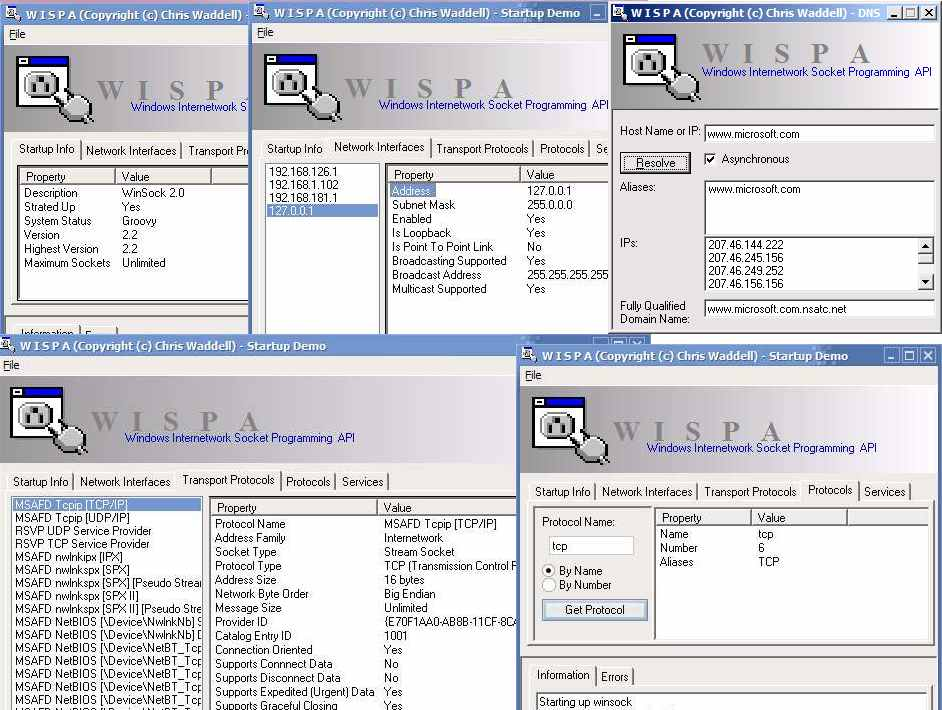



## Complete Winsock Library

### Description

This is a very complete, rich object oriented DLL which provides an easy to use set of classes for working with all aspects of winsock programming. It includes dns, enumeration, socket options, socket io, async and blocking mode and much more. IMPORTANT: This library isn't really complete. It's complete enough to use, but it hasn't been tested, and some things still don't work. I gave up on it half way through and started working on something else. Right now I don't know if I'll bother finishing it (possibly some time in the future) so I figured I'd release it to the public. If you ever want to work with Winsock API then this is a must, even if just for the incredibly compelte winsock.bas module I wrote for it.
 
### More Info
 

             |
---                |---
**Submitted On**   |2004-05-08 01:21:40
**By**             |[IRBMe](https://github.com/Planet-Source-Code/PSCIndex/blob/master/ByAuthor/irbme.md)
**Level**          |Advanced
**User Rating**    |4.5 (36 globes from 8 users)
**Compatibility**  |VB 6\.0
**Category**       |[Internet/ HTML](https://github.com/Planet-Source-Code/PSCIndex/blob/master/ByCategory/internet-html__1-34.md)
**World**          |[Visual Basic](https://github.com/Planet-Source-Code/PSCIndex/blob/master/ByWorld/visual-basic.md)
**Archive File**   |[Complete\_W1770747172004\.zip](https://github.com/Planet-Source-Code/irbme-complete-winsock-library__1-54992/archive/master.zip)

